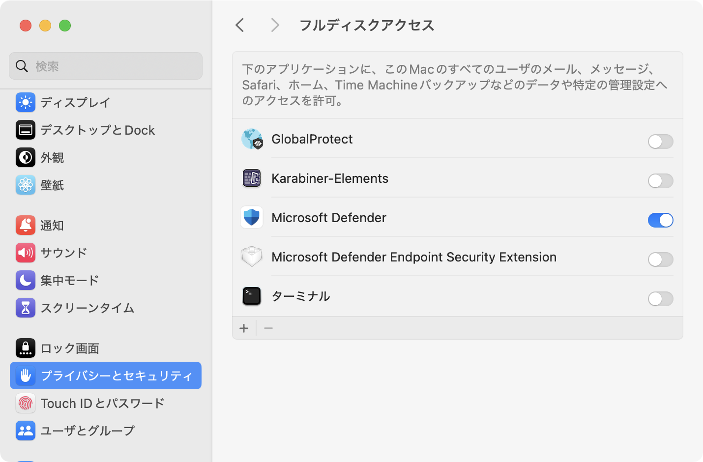
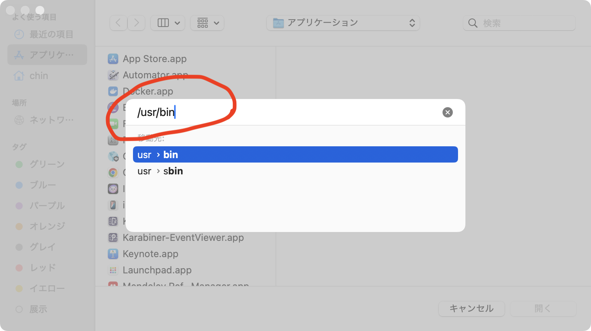
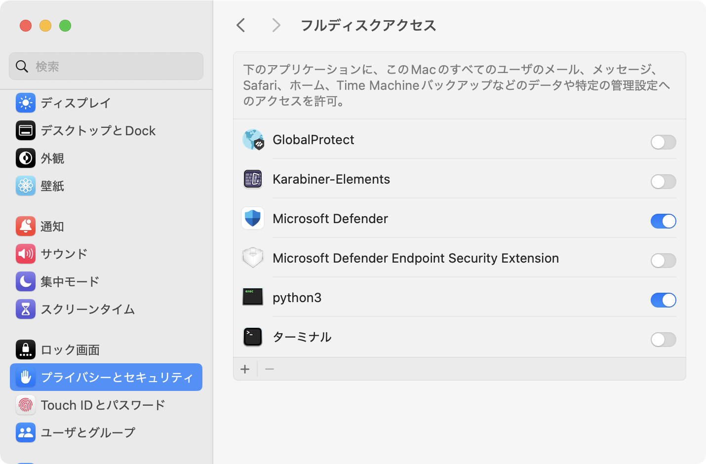

# Obsidian Search Logger - Trouble shooting

When Obsidian Search Logger does not work, try the following.
The problem can be either the browser javascript side, the python side, or the LaunchAgent matter.

### Browser / Javascript side debugging

1. Check userscript is activated.
   You need to activate both Userscripts (or Tampermon) extension itself and the javascript.
   Also make sure www.google.com (and any search sites you use) are marked as 'allow' in the setting of Userscripts.

### Python side debugging

1. Run `obsidian_logger.py` manually in debug mode.
   You can run the python script in Terminal.app with
   ```
   cd (this folder)
   ./obsidian_logger.py ~/ test.md debug
   ```
   This will record the log in ~/test.md -- actually the save folder is not limited to an Obsidian vault -- any folder you have a write permission will work.
   Running `obsidian_logger.py` in debug mode will print information on how the script works. If everything goes file, it should look like
   ```
   🟢 Starting logger...
   📒 Logging to:  /Users/(your login name)/test.md
   🔌 Server is listening on http://localhost:(port number)
   ```
   If the last line is
   ```
   ❌ Server error: [Errno 48] Address already in use
   ```
   It means that `obsidian_logger.py` is already running fine. If so the problem is likely in the browser side. Go back 1.

2. Check log files in `/tmp`.
   If the manual run is fine, it's likely the LaunchAgent matter.
   Check `com.obsidian-logger.launch-stdout.log` and `com.obsidian-logger.launch-stderr.log` in `/tmp`.

3. Manually run `setup_logger_macos.py`
   Most likely, Privacy & Security setting in System Setting is teh source of the trouble.

## TCC setting
MacOS regulates accesses to certain user folders like `Documents`, `Desktop` and iCloud storage. It is called TCC (Transparency, Consent and Control). Running a python script from LaunchAgent can be affected by this regulation. The easiest way to overcome this regulation is to allow a full-disk access to  `python3`.
`setup_logger.py` can automatically guide you by opening System Setting.app. You need to do it by yourself.
### Set full-disk access
 1. `setup_logger.py` opens System Setting.app for you. You will see something like this:
    
 2. Click `'+'`.
 3. Type `⌘` and `Shift` and **`G`** keys to get a small window to type directory path.
   
 4. Type the path, then type **return**. You will get a long list of commands. Find `python3` and click `Open`.
 5. You will now have `python3` in the full-disk assess list.
    

---
from README
